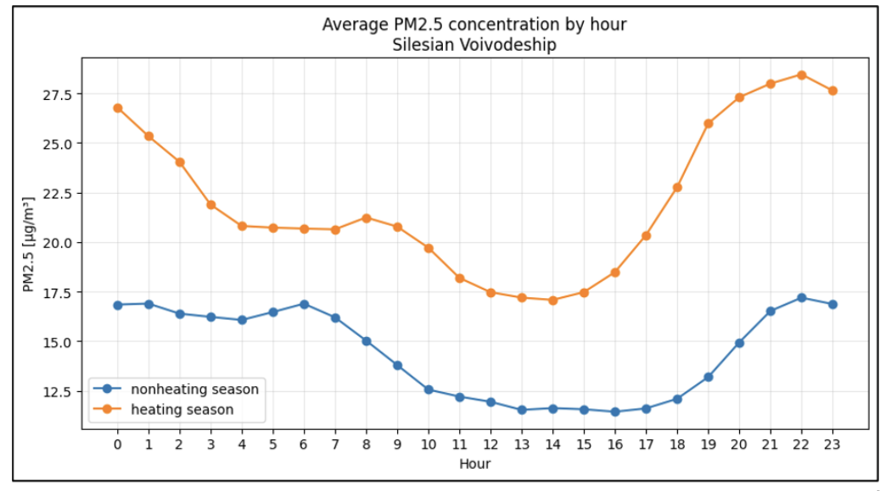
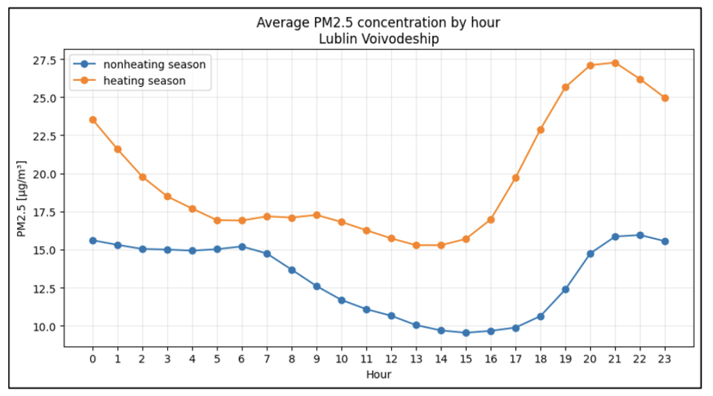
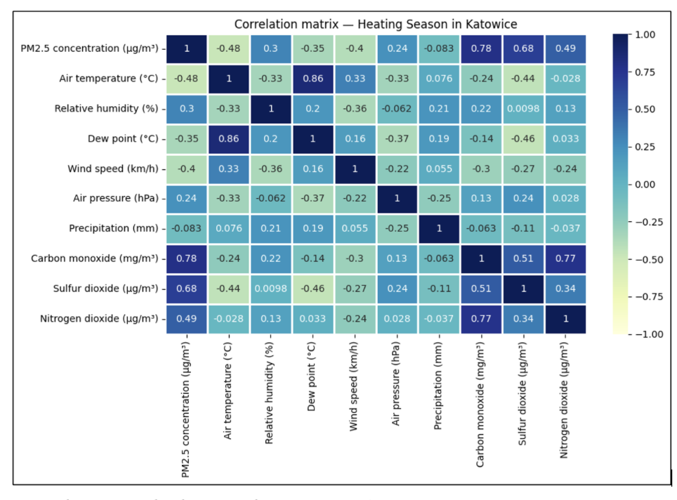
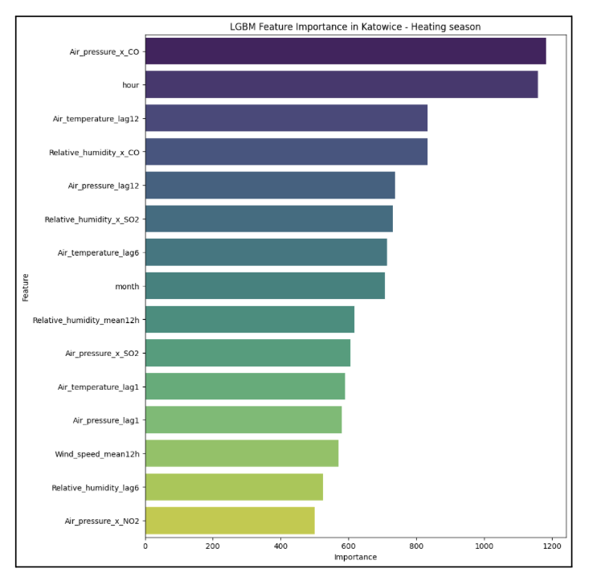

# PM2.5 Prediction Using Meteorological Data and Machine Learning

## Project Overview

This repository presents a research project focused on the analysis and prediction of PM2.5 air pollution concentrations using meteorological and environmental data combined with machine learning methods.

The project was developed as part of an undergraduate engineering thesis investigating relationships between atmospheric conditions and particulate matter variability, as well as evaluating the predictive performance of selected ML models.

Source code is not publicly available due to planned scientific publications.  
This repository documents methodology, research design, and results.

## Objectives

The main goals of the project were:

- analysis of temporal and spatial variability of PM2.5 concentrations,
- identification of relationships between air pollution and meteorological factors,
- feature engineering for environmental time-series data,
- comparison of machine learning models for PM2.5 prediction,
- evaluation of predictive performance using statistical metrics.

Dataset

The study used environmental data from 2023 collected from air quality monitoring stations located in Poland:

- **Silesian Voivodeship:** Katowice, Bielsko-Biała
- **Lublin Voivodeship:** Lublin, Zamość

### Data sources included:

- PM2.5 daily concentrations,
- gaseous pollutants: SO₂, NO₂, CO,
- meteorological variables:
  - air temperature,
  - relative humidity,
  - wind speed,
  - precipitation,
  - atmospheric pressure.

Data preprocessing included synchronization, cleaning, handling missing values, and temporal aggregation.

## Exploratory Data Analysis (EDA)

The analysis revealed:

- strong seasonal variability of PM2.5 concentrations,
- significantly higher pollution levels during the heating season,
- negative correlation with temperature and wind speed,
- co-occurrence patterns between PM2.5 and gaseous pollutants.

These findings confirmed the influence of atmospheric stagnation conditions on pollution accumulation.

## Feature Engineering

The following features were created:

- lag variables,
- temporal aggregates,
- seasonal indicators,
- time-based features,
- interaction-related environmental predictors.

Feature engineering significantly improved model performance.

## Machine Learning Models

The following algorithms were evaluated:

- Random Forest
- XGBoost
- LightGBM
- Support Vector Regression (SVR)
- Multilayer Perceptron (MLP)

Models based on ensemble decision trees achieved the highest predictive accuracy.

## Evaluation Metrics

Models were compared using:

- RMSE (Root Mean Square Error)
- MAE (Mean Absolute Error)
- R² score

Tree-based ensemble methods demonstrated superior performance in modeling nonlinear environmental relationships.

## Key Findings

- PM2.5 variability strongly depends on meteorological conditions.
- Heating season significantly increases pollution levels.
- Machine learning models effectively capture nonlinear dependencies.
- Ensemble methods outperform classical regression approaches.

The results indicate that ML-based models can support air quality monitoring and environmental decision-making systems.

## Research Context

This project contributes to environmental data science and demonstrates practical applications of machine learning in air quality modeling and environmental analytics.

Related scientific publications based on this research are currently under review.

## Tech Stack

- Python
- pandas, NumPy
- scikit-learn
- XGBoost, LightGBM
- matplotlib / data visualization
- environmental time-series analysis

## Key Visual Insights

### Seasonal Variability of PM2.5

Seasonal decomposition of PM2.5 concentrations indicates substantial increases during the heating season, driven by intensified low-stack emissions and unfavorable meteorological conditions.

Hourly aggregation highlights recurrent evening and nighttime peaks, suggesting strong temporal dependency structures in the data. These patterns justify the inclusion of lag features and seasonal indicators in the predictive modeling pipeline.

Regional differences further emphasize the role of emission density and urban structure in shaping concentration dynamics.

---

### Correlation Analysis

Correlation analysis provides insight into the relationships between PM2.5 concentrations and both meteorological and gaseous variables.

A clear negative correlation is observed between PM2.5 and air temperature, particularly during the heating season, reflecting increased emissions under low-temperature conditions. Wind speed also shows a negative correlation, confirming its role in enhancing pollutant dispersion.

Positive correlations are visible between PM2.5 and gaseous pollutants such as NO₂, SO₂, and CO, indicating common emission sources related to combustion processes (residential heating and traffic).

Relative humidity exhibits a moderate positive association with PM2.5, which may be linked to hygroscopic growth of aerosol particles and secondary aerosol formation under high-moisture conditions.

---

### Feature Importance (Tree-Based Model)

### Feature Importance (LightGBM – Heating Season, Katowice)

Feature importance analysis from the LightGBM model highlights the complex and non-linear structure of PM2.5 drivers during the heating season.

Atmospheric pressure interacting with CO (`Air_pressure_x_CO`) emerges as the most influential predictor, suggesting that combustion-related emissions combined with stable high-pressure systems significantly contribute to pollution accumulation.

Temporal features such as `hour` rank among the most important variables, confirming strong diurnal concentration cycles and justifying the inclusion of time-based predictors.

Lagged temperature variables (`Air_temperature_lag12`, `Air_temperature_lag6`, `Air_temperature_lag1`) also show high importance, reflecting both delayed emission responses and meteorological persistence effects.

Interaction terms between humidity and gaseous pollutants (e.g., `Relative_humidity_x_CO`, `Relative_humidity_x_SO2`) indicate that secondary aerosol formation and hygroscopic growth processes play a meaningful role in shaping PM2.5 levels.

The dominance of interaction and lag-based variables further validates the use of gradient boosting models, which are well-suited for capturing complex non-linear dependencies in environmental time-series data.

## Model Performance

Model performance was evaluated using a dedicated test set and 5-fold cross-validation (shuffle=True, random_state=42). Performance metrics were computed exclusively on unseen data.

Evaluation metrics:

- RMSE (Root Mean Square Error)
- MAE (Mean Absolute Error)
- R² (Coefficient of Determination)

---

### Example Results – Katowice

#### Heating Season

| Model         | RMSE (µg/m³) | MAE (µg/m³) | R²   |
| ------------- | ------------ | ----------- | ---- |
| SVR           | 5.71         | 3.55        | 0.87 |
| Random Forest | 4.66         | 3.25        | 0.91 |
| XGBoost       | 4.48         | 3.23        | 0.92 |
| LightGBM      | 4.08         | 2.83        | 0.93 |
| MLP           | 4.30         | 3.20        | 0.92 |

#### Non-Heating Season

| Model         | RMSE (µg/m³) | MAE (µg/m³) | R²   |
| ------------- | ------------ | ----------- | ---- |
| SVR           | 3.36         | 2.33        | 0.74 |
| Random Forest | 2.90         | 2.16        | 0.81 |
| XGBoost       | 3.08         | 2.34        | 0.78 |
| LightGBM      | 2.54         | 1.87        | 0.85 |
| MLP           | 2.87         | 2.08        | 0.81 |

---

### Key Observations

- Tree-based ensemble models consistently outperformed SVR across both seasons.
- LightGBM achieved the best overall performance, with the lowest RMSE and MAE and the highest R².
- All models performed better during the non-heating season, reflecting lower emission variability and more stable atmospheric conditions.
- The heating season introduces higher non-linearity and stronger emission-driven variability, increasing prediction difficulty.

Across all analyzed cities (Katowice, Bielsko-Biała, Lublin, Zamość), the performance hierarchy remained consistent:
LightGBM > XGBoost ≈ Random Forest ≈ MLP > SVR.

## Short-Term Forecasting Performance

To evaluate model stability over time, short-term forecasting horizons were tested for 1-hour, 6-hour, and 12-hour predictions.

Performance was assessed using RMSE, MAE, and R².

---

### Example – Katowice

| Forecast Horizon | RMSE (µg/m³) | MAE (µg/m³) | R²   |
| ---------------- | ------------ | ----------- | ---- |
| 1 hour           | 5.99         | 4.34        | 0.57 |
| 6 hours          | 8.77         | 6.00        | 0.24 |
| 12 hours         | 10.17        | 6.98        | 0.10 |

---

### Key Observations

- The highest predictive accuracy was achieved for 1-hour forecasts.
- Model performance decreases as the forecasting horizon increases.
- RMSE and MAE grow steadily with longer horizons.
- R² drops significantly for 6-hour and 12-hour predictions.

This decline reflects the increasing uncertainty associated with meteorological variability, emission fluctuations, and pollutant transport processes over time.

Despite performance degradation, the models maintain the ability to capture overall concentration trends, particularly for short-term predictions.

The results indicate strong applicability for real-time air quality monitoring systems, where short-term forecasts are most critical for public health decision-making.

## Limitations & Future Work

- Analysis limited to year 2023
- No inclusion of traffic intensity or detailed emission inventory data
- No multi-year trend analysis
- Potential extension: multi-city transfer learning
- Potential extension: LSTM or Transformer-based temporal modeling

## Project Highlights

- End-to-end machine learning pipeline for environmental time-series data
- Multi-city and seasonal comparison
- Advanced feature engineering (lags, rolling statistics, interaction terms)
- Comparative evaluation of five regression models
- Short-term forecasting analysis (1h, 6h, 12h)
- Model interpretability via feature importance analysis

## Author

Agnieszka Głowacka

Engineering thesis project in Data Science / Environmental Machine Learning.
